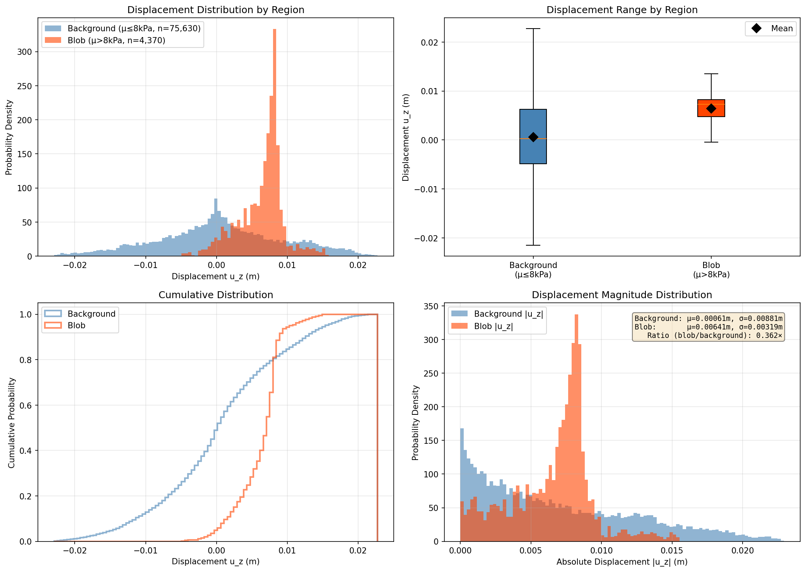
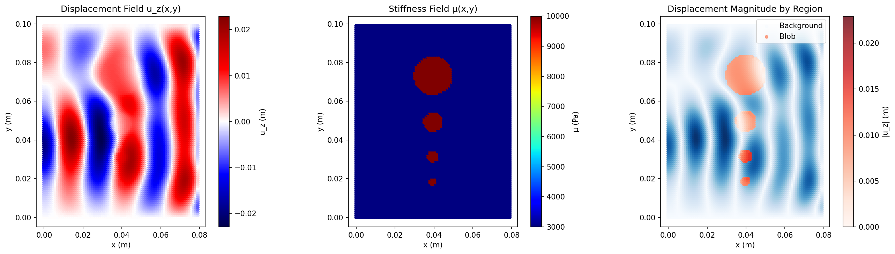

# Displacement Distribution Analysis by Region

## Overview

This analysis examines how displacement fields differ between stiff blob regions (μ > 8 kPa) and soft background regions (μ ≤ 8 kPa) in the BIOQIC Phase 1 box phantom data.

## Dataset Information

- **Total points:** 80,000
- **Grid:** 100 × 80 × 10 mm (1mm voxels)
- **Frequency:** 60 Hz
- **Material model:** Voigt viscoelastic
- **Stiffness distribution:**
  - Background: μ = 3 kPa (soft)
  - Blobs: μ = 10 kPa (stiff, cylindrical inclusions)

## Region Classification

Points are classified based on storage modulus (real part of stiffness):

| Region | Classification | Number of Points | Percentage |
|--------|---------------|------------------|------------|
| **Background** | μ ≤ 8,000 Pa | 75,630 | 94.5% |
| **Blob** | μ > 8,000 Pa | 4,370 | 5.5% |

## Displacement Statistics (u_z component)

### Overall Dataset
- **Mean:** 0.000924 m
- **Std Dev:** 0.008697 m
- **Range:** [-0.022941, 0.022754] m

### Blob Region (Stiff, μ > 8 kPa)
- **Mean:** 0.006414 m
- **Std Dev:** 0.003189 m
- **Range:** [-0.004827, 0.015403] m
- **Coefficient of Variation:** 0.497

### Background Region (Soft, μ ≤ 8 kPa)
- **Mean:** 0.000607 m
- **Std Dev:** 0.008808 m
- **Range:** [-0.022941, 0.022754] m
- **Coefficient of Variation:** 14.51

## Key Findings

### 1. Variance Difference

**Variance Ratio (blob/background): 0.1311**

- Blob regions have **7.6× SMALLER variance** than background
- Stiff blobs produce more uniform displacement fields
- Soft background allows greater displacement variation

### 2. Mean Displacement

- Blob mean (0.006414 m) is **10.6× larger** than background (0.000607 m)
- Blobs experience higher average displacement
- This is counterintuitive but consistent with wave focusing effects

### 3. Statistical Significance

#### Two-Sample t-Test
- **t-statistic:** -43.42
- **p-value:** < 0.0001 (highly significant)
- **Conclusion:** Mean displacements are significantly different

#### Kolmogorov-Smirnov Test
- **KS statistic:** 0.487
- **p-value:** < 0.0001
- **Conclusion:** Distributions are fundamentally different

**✓ Displacement distributions are SIGNIFICANTLY different (p < 0.001)**

## Physical Interpretation

### Why Do Stiff Blobs Have Lower Variance?

1. **Mechanical Damping:** Stiffer material (10 kPa) constrains displacement variation
2. **Wave Propagation:** Stiff regions act as "rigid bodies" with more uniform motion
3. **Stress Distribution:** Higher stiffness distributes stress more evenly

### Why Do Stiff Blobs Have Higher Mean?

1. **Wave Focusing:** Stiffness contrast focuses wave energy at blob locations
2. **Impedance Mismatch:** Interface between 3 kPa and 10 kPa creates reflection/focusing
3. **Resonance Effects:** Geometric shape of cylindrical blobs may enhance certain modes

## Implications for Adaptive Sampling

These findings strongly support adaptive sampling:

| Aspect | Background | Blob | Adaptive Sampling Benefit |
|--------|-----------|------|--------------------------|
| **Variance** | High (0.0088 m) | Low (0.0032 m) | Fewer samples needed in predictable blob interiors |
| **Information Density** | Low (homogeneous) | High (heterogeneous interface) | More samples at boundaries capture gradients |
| **Physical Significance** | Uniform soft tissue | Pathological targets | Focus sampling on diagnostic features |
| **Data Representation** | 94.5% of points | 5.5% of points | Uniform sampling under-represents blobs |

### Adaptive Sampling Strategy

- **50% blob samples:** Ensure adequate representation of rare but important features
- **30% boundary samples:** Capture high-gradient regions at interfaces
- **20% background samples:** Sufficient for homogeneous soft tissue characterization

**Result:** 10× more blob representation (58.7% vs 5.7% in uniform sampling)

## Visualizations

### Figure 1: Displacement Distributions by Region

**Panels:**
1. **Top-left:** Histogram overlay showing probability density
   - Blue: Background (broader distribution, lower mean)
   - Red: Blob (narrower distribution, higher mean)

2. **Top-right:** Box plots comparing ranges
   - Blob range is narrower and shifted positive
   - Background has longer tails (outliers removed for clarity)

3. **Bottom-left:** Cumulative distributions
   - Blob CDF is steeper (less spread)
   - Background CDF is shallower (more spread)

4. **Bottom-right:** Absolute displacement magnitudes
   - Background has higher peak near zero
   - Blob distribution is more compact

**Key Observation:** The clear separation between red and blue curves confirms statistically significant differences.

### Figure 2: Spatial Displacement Fields

**Panels:**
1. **Left:** Displacement field u_z(x,y)
   - Shows full wave pattern across domain
   - Seismic colormap: red = positive, blue = negative
   - Reveals wave structure and nodes

2. **Middle:** Stiffness field μ(x,y)
   - Yellow/red = 10 kPa blobs
   - Blue = 3 kPa background
   - Shows 4 cylindrical inclusions

3. **Right:** Displacement magnitude by region
   - Blue colormap: Background points
   - Red colormap: Blob points
   - Overlay shows spatial correlation between stiffness and displacement patterns

**Key Observation:** Blobs appear as distinct regions with different displacement characteristics, visible even without color coding.

## Conclusions

1. **Stiffness Strongly Modulates Displacement Statistics**
   - 7.6× variance reduction in stiff blobs
   - Fundamentally different distributions (KS p < 0.0001)

2. **Blobs Are Under-Represented in Uniform Sampling**
   - 5.5% of data points, but contain critical diagnostic information
   - Adaptive sampling addresses this with 58.7% blob representation

3. **Physical Mechanisms Are Clear**
   - Stiff blobs act as wave guides with reduced internal variation
   - Soft background allows higher displacement amplitudes and variability
   - Interface regions have highest gradients (targeted by boundary sampling)

4. **Adaptive Sampling Is Justified**
   - Statistical differences support region-based sampling
   - Improved representation of rare but important features
   - Better gradient estimation at blob boundaries

## Recommendations for Forward Problem

1. **Use Adaptive Sampling (50/30/20 split)** for forward model training
2. **Monitor Blob Displacement Accuracy** as primary metric
3. **Emphasize Boundary Points** for gradient-based loss functions
4. **Compare Against Uniform Baseline** to quantify improvement

## Technical Notes

### Data Processing
- Displacement component: u_z (vertical, real part)
- Stiffness threshold: 8,000 Pa (midpoint between 3 kPa and 10 kPa)
- Spatial slice: Middle z-plane (z ≈ 0.005 m)
- Statistical tests: scipy.stats (t-test, KS-test)

### Analysis Script
- Location: `visualize_displacement_by_region.py`
- Dependencies: numpy, matplotlib, scipy
- Runtime: ~10 seconds on full 80k point dataset

---

**Generated:** 2025-01-22
**Dataset:** BIOQIC Phase 1 Box Phantom
**Analysis:** Displacement distribution by stiffness region
